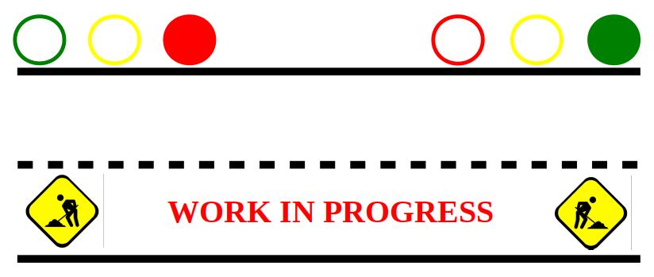
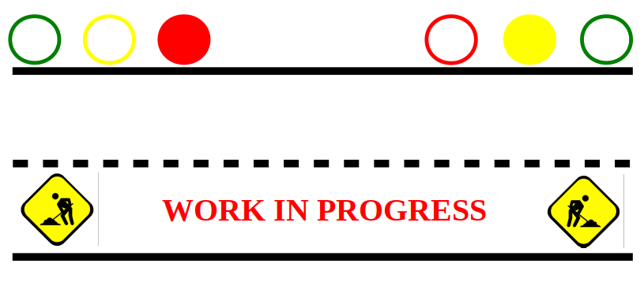
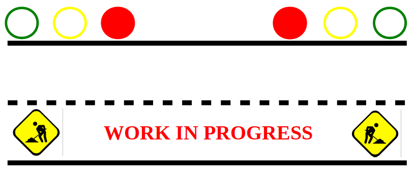

# Temporary Traffic Light

## 1.   Challenge

On a street, road work is taking place. Thus, only one track is free for both directions. For safety reasons, this section has to be protected by traffic lights. The task is to construct a traffic light system, so that only vehicles from one direction may enter the area for some time. Permission to enter the section is changed periodically.

 

## 2.   Introduction
Traffic lights, also known as traffic signals are signaling devices positioned at or near road intersections, pedestrian crossings and other locations to control  competing flows of  traffic. They alternate the order of road users by displaying lights of a standard color (red,  yellow/amber, and green). Basically, it is used to control traffic or road users.
 

## 3.   Methodology
In the project, we decided to use a _pre-timed signal_ since we did not make use of any sensor device. 
**Pre-timed:** at  pre-timed  traffic  signals  each  signal  phase  or  traffic  movement  is  serviced  in  a programmed sequence that is repeated throughout the day. The cycle length is programmed for a duration of time in seconds. 
The signal design procedure involves some major steps. Which includes 
* Phase design, 
* Determination of amber time and clearance time, 
* Determination of cycle length, 
* Apportioning of green time  and red time
 

## 4.   Requirements and design
The folllowing figures shows a step by step transition of the traffic light system

### System design

To achieve the above system, the following equipments are needed for a complete design of the whole project:
* Arduino UNO
* Breadboard
* 2 Green LEDs
* 2 Red LEDs
* 2 Yellow LEDs
* Resistors (220 Ω)
* Wires
 

## 5. Implementation
The code for this project can be found in the repository.
 

## References
[1] M.R.M Hafizullah,  Md. Sabuj Ahamed, _\"Implementation of Automatic Traffic Light Controller\"_. Department of Electrical and Electronic Engineering NORTHERN UNIVERSITY BANGLADESH: 2013.\
[2] [https://nptel.ac.in/courses/105101087/downloads/Lec-41.pdf](https://nptel.ac.in/courses/105101087/downloads/Lec-41.pdf)

